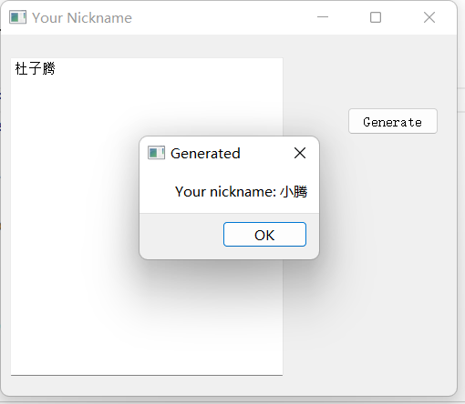
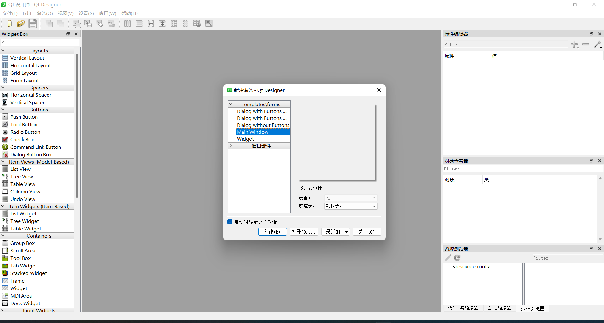

<!-- 设置两端对齐： 
<p style="text-align:justify">
&emsp;&emsp; 
</p> 
-->
# 图形应用界面开发 （PyQt5 教程）
目前基于python的图形界面开发工具有：

- Tkinter

<p style="text-align:justify">
&emsp;&emsp;python 的标准库， 稳定但控件较少 
</p>

- wxPython
<p style="text-align:justify">
&emsp;&emsp;基于wxWidgets 库，控件丰富但稳定性差，文档少。 
</p>

- pyside2 和 PyQt 
<p style="text-align:justify">
&emsp;&emsp;基于 Qt 库，控件丰富、用户体验好但占用体积大。 
</p>

**<font color="deep red">本文主要记录PyQt5 库的使用。</font>**

## 1 安装 
使用 **pip** 命令：
```python
# pyside2

pip install pyside2 -i https://pypi.douban.com/simple/

# PyQt5 

pip install pyqt5-tools -i https://pypi.douban.com/simple/
```

## 2 快速开始
<p style="text-align:justify">
&emsp;&emsp; 一个简单的小例子：帮你起绰号的一个小程序。
</p>

```python
from PySide2.QtWidgets import QApplication, QMainWindow, QPushButton, QPlainTextEdit, QMessageBox

class Stats():
    def __init__(self):
        self.window = QMainWindow()
        self.window.resize(500, 400)
        self.window.move(300, 300)
        self.window.setWindowTitle('Your Nickname')

        self.textEdit = QPlainTextEdit(self.window)
        self.textEdit.setPlaceholderText("Please input your name")
        self.textEdit.move(10, 25)
        self.textEdit.resize(300, 350)

        self.button = QPushButton('Generate', self.window)
        self.button.move(380, 80)

        self.button.clicked.connect(self.handleGen)


    def handleGen(self):
        info = self.textEdit.toPlainText()

        nickname = "小" + info[-1]

        QMessageBox.about(self.window, 
                          "Generated",
                          f" Your nickname: {nickname}")

app = QApplication([])
stats = Stats()
stats.window.show()
app.exec_()
```

<p style="text-align:justify">
&emsp;&emsp; 运行结果如下图所示：
</p>



## 3 界面布局和设置

<p style="text-align:justify">
&emsp;&emsp; 通过designer.exe 制作自己喜欢的 UI 界面。进入自己安装的库里，找designer.exe 文件，双击打开即可进行操作。打开后界面如下所示：
</p> 



<p style="text-align:justify">
&emsp;&emsp; 设计好后保存的UI文件，通过python加载出来使用。有两种方式，动态加载和转化UI文件为python代码。
</p> 

- **动态加载 ui 文件方式**

```python
from PySide2.QtWidgets import QApplication, QMainWindow, QPushButton, QPlainTextEdit, QMessageBox
from PySide2.QtUiTools import QUiLoader
# PyQt5 加载 ui 文件 需要的类
# from PyQt5 import uic

class Stats():
    def __init__(self):
        # Pyside2 库加载方式
        self.window = QUiLoader().load("***.ui")

        # PyQt5 库加载方式
        # self.window = uic.loadUi("***.ui")

        self.window.button.clicked.connect(self.handleGen)


    def handleGen(self):
        info = self.textEdit.toPlainText()

        nickname = "小" + info[-1]

        QMessageBox.about(self.window, 
                          "Generated",
                          f" Your nickname: {nickname}")

app = QApplication([])
stats = Stats()
stats.window.show()
app.exec_()
```

- **转化 UI 文件为 Python 代码**

```shell
# Pyside2 执行如下命令 

pyside2-uic main.ui > ui_main.py

# PyQt5 执行如下命令 

pyuic5 main.ui > ui_main.py
```

<p style="text-align:justify">
&emsp;&emsp; 然后在程序中使用生成的 ui 类。
</p> 

```python
from PySide2.QtWidgets import QApplication,QMainWindow
from ui_main import *

# 注意 这里选择的父类 要和你UI文件窗体一样的类型
# 主窗口是 QMainWindow， 表单是 QWidget， 对话框是 QDialog
class MainWindow(QMainWindow):

    def __init__(self):
        super().__init__()
        # 使用ui文件导入定义界面类
        self.ui = Ui_MainWindow()
        # 初始化界面
        self.ui.setupUi(self)

        # 使用界面定义的控件，也是从ui里面访问
        self.ui.webview.load('http://www.baidu.com')

app = QApplication([])
mainw = MainWindow()
mainw.show()
app.exec_()
```

- **界面布局 Layout**


