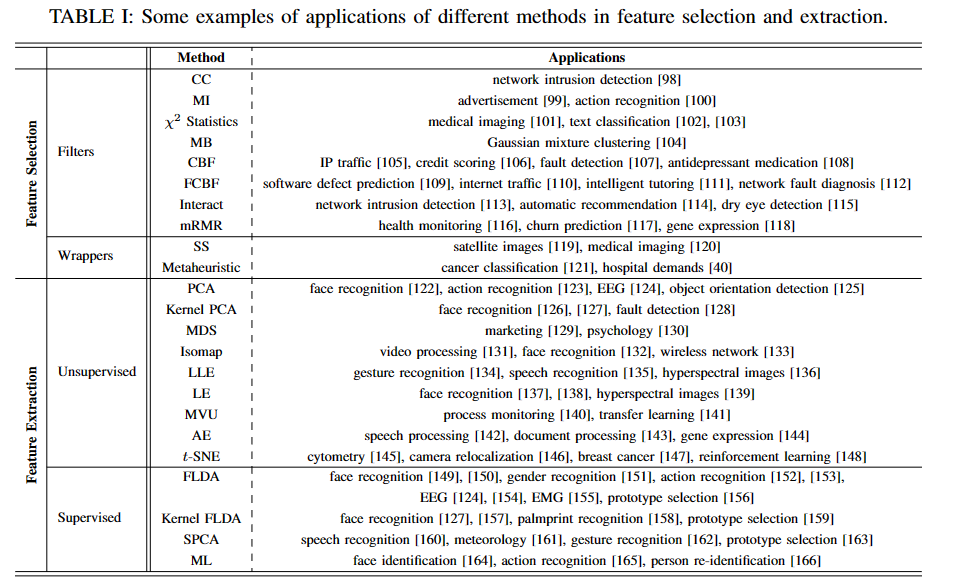

# 记录阅读的重要论文

## Paper 1 [Feature Selection and Feature Extraction in Pattern Analysis:A Literature Review](https://arxiv.org/abs/1905.02845)

### 简介：
&emsp;&emsp; 模式分析（Pattern Analysis）通常需要一个预处理阶段对数据进行特征选择或提取，使模型达到更好的分类、回归或聚类性能。因为原始数据通常较复杂，维度也较高。这篇论文综述了特征选择和特征提取的方法以及他们的应用。
### 主要内容：
* 引入：   
&emsp;&emsp; 假设有 $n$ 个样本被表示为 $\{\mathcal{x}_{i}\}^{n}_{i}$，其中第 $i$ 个样本为 $\mathcal{x}_{i}$，是一个维度为 $d$ 的列向量（$\mathcal{x}_{i} \in \mathbb{R}^{d}$）。将 $n$ 个样本表示为矩阵的形式为：$\mathrm{X} = \{\mathcal{x}_{1}, \mathcal{x}_{2}, \ldots, \mathcal{x}_{n} \} = \{\mathcal{x}^{1}, \mathcal{x}^{2}, \ldots, \mathcal{x}^{d}\} ^{T} \in \mathbb{R}^{d \times n}$。如果每个样本都有相应的标签的话，则将标签定义为：$\mathcal{t} = \{t_{1}, t_{2}, \ldots, t_{n}\}^{T}$。特征选择和特征提取的目的就是将原始样本数据映射到一个低维空间而尽可能保留原始数据的“本质特征”。数学表述为：$\mathcal{x} \longrightarrow \mathcal{y}$，其中 $\mathcal{x} \in \mathbb{R}^{d}$, $\mathcal{y} \in \mathbb{R}^{p}$，$p \le d$。特征选择算法和特征提取算法的区别在于：在特征选择算法中，选取的特征是原始数据特征的子集，即 $\{\mathcal{y}^{j}\}^{p}_{j=1} \subseteq \{ \mathcal{x}^{i} \}^{d}_{i=1}$。在特征提取算法中，提取的特征是一个全新的特征集合（对原始特征经过“编码”后的新的特征），通常 $p << d$。
* 特征选择算法  
&emsp;&emsp;特征选择算法分类滤波器（Filter）方法和包裹器（Wrapper）方法。  
    1. Filter方法：该方法基于对特征的重要性得分排列准则，通过设置阈值留下重要的特征而去掉冗余特征。该方法基于特征与特征之间或特诊与样本之间的相关性及冗余性概念。常用于Filter方法计算特征得分的准则有： 
        1.1 相关性准则（Correlation Criteria）：根据相关性系数大小挑选特征，常用皮尔逊相关系数（Pearson Correlation
Coefficient）。     

        1.2 [互信息（Mutual Information）& 信息增益（Information Gain）](https://www.sciencedirect.com/science/article/abs/pii/S1084804511000038)：是两个变量（比如特征和标签）之间依赖和共享信息量的测量。也被描述为 Information Theoretic Ranking Criteria (ITRC)。 

        1.3 [$\chi ^{2}$ Statistics](https://dl.acm.org/doi/10.5555/944919.944974)：测量特征值的出现对目标（标签）的依赖性，基于卡方分布进行计算。适用于离散有限的数据。   

        1.4 [Markov Blanket ](https://www.researchgate.net/publication/45534403_Markov_Blanket_based_Feature_Selection_A_Review_of_Past_Decade)：基于马尔科夫链的特征选择方法主要是通过测量特征和标签之间的相关性实现。  

        1.5 [Consistency-based Filter](https://www.sciencedirect.com/science/article/pii/S0004370203000791)：基于一致性得 Filter 通过测量特征之间的相关性和冗余性实现特征选择。  

        1.6 [Fast Correlation-based Filter (FCBF)](https://www.semanticscholar.org/paper/Feature-Selection-for-High-Dimensional-Data%3A-A-Fast-Yu-Liu/b8d7788f25dfaf0f9fe2e6c441d75ca7cd3bc09a): FCBF 方法基于熵（也称Symmetrical Uncertainty (SU)）准则计算特征和标签之间的相关性。     

        1.7 [Interact](https://www.researchgate.net/publication/220816176_Searching_for_Interacting_Features)：Interact 方法是通过计算特征之间的相关性实现特征选择，其它大多数算法都是计算特征与标签之间的相关性。

        1.8 [Minimal-Redundancy-Maximal-Relevance](https://pubmed.ncbi.nlm.nih.gov/15852500/)：最小冗余最大相关特征选择方法通过最小化特征的冗余性同时最大化特征和标签的相关性实现特征选择。  

    1. Wrapper方法： 该方法将原始数据特征子集的挑选过程与模型融合在一起，通过遍历原始数据特征的所有特征子集经模型训练后的性能，选出使模型性能达到最好的特征子集集合。该方法的缺点是算法的时间复杂度高。常见的 Wrapper 方法有：  
   
        1.1 [Sequential Selection Methods](https://link.springer.com/chapter/10.1007/978-1-4612-2404-4_19)：顺序特征选择算法按顺序在给定的特征空间里挑选特征，也就是常见的遍历法。按照遍历的方式可以分为顺序前向选择（SFS）和顺序后向选择（SBS）。顺序前向选择算法在初始化时挑选的特征子集为空集，通过在原特征空间里遍历特征组合，一个个向特征子集中添加能提升模型性能的特征。顺序后向选择算法恰恰相反，初始化时特征子集为原特征空间，通过在原特征空间里遍历特征组合，一个个向特征子集中移除对模型性能影响较小或不影响的特征。      

        1.2 Metaheuristic Methods： Metaheuristic Methods也叫进化算法，目的是为了改善顺序选择算法计算复杂度高的缺点，同时又能挑选出相对理想化的特征子集。常见的有粒子群优化算法和遗传算法。    
 
* 特征提取算法                
&emsp;&emsp;特征提取算法是将原特征空间映射到一个低维的编码特征空间。有无监督和监督特征提取两种方式。
    1. 无监督特征提取算法：无监督方法指直接将原特征进行编码，而不考虑其与标签之间的联系。常见的方法有：             
        1.1 Principal Component Analysis（PCA）                         
        1.2 Dual Principal Component Analysis                                
        1.3 Kernel Principal Component Analysis（kPCA）                              
        1.4 Multidimensional Scaling（MDS）                                 
        1.5 Isomap                              
        1.6 Locally Linear Embedding（LLE）      
        1.7 Laplacian Eigenmap                                                                
        1.8 Maximum Variance Unfolding                                                              
        1.9 Autoencoders & Neural Networks             
        1.10 t-distributed Stochastic Neighbor Embedding （t-SNE）                                                                       
    2. 监督特征提取算法 ：监督方法则是考虑原特征与标签额情况下对原特征进行编码。常见的方法有：             
        1.1 Fisher Linear Discriminant Analysis（FLDA）                                          
        1.2 Kernel Fisher Linear Discriminant Analysis（kFLDA）                                         
        1.3 Supervised Principal Component Analysis（SPCA）                                                 
        1.4 Metric Learning（ML）                                   

* 特征选择和特征提取算法的应用

### 结论：
&emsp;&emsp;该论文主要让大家熟悉了解常见的特征选择及特征提取算法。
### 备注：
&emsp;&emsp; 略
## Paper 2 [Feature Selection Using a Neural Network With Group Lasso Regularization and Controlled Redundancy](https://pubmed.ncbi.nlm.nih.gov/32396104/)

### 简介
&emsp;&emsp;

### 主要内容
&emsp;&emsp;

### 结论
&emsp;&emsp;

### 备注
&emsp;&emsp;

## Paper 3 [Low Dimensional Trajectory Hypothesis is True: DNNs Can Be Trained in Tiny Subspaces](https://ieeexplore.ieee.org/document/9782552)

### 简介
&emsp;&emsp;

### 主要内容
&emsp;&emsp;

### 结论
&emsp;&emsp;

### 备注
&emsp;&emsp;

## Paper 4 [Multimodal Dynamics: Dynamical Fusion for Trustworthy Multimodal Classification](https://ieeexplore.ieee.org/document/9878603)

### 简介
&emsp;&emsp;

### 主要内容
&emsp;&emsp;

### 结论
&emsp;&emsp;

### 备注
&emsp;&emsp;

